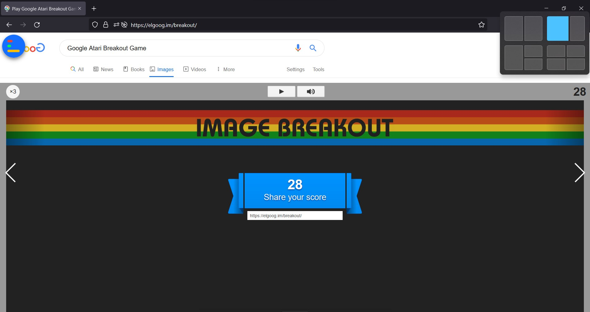
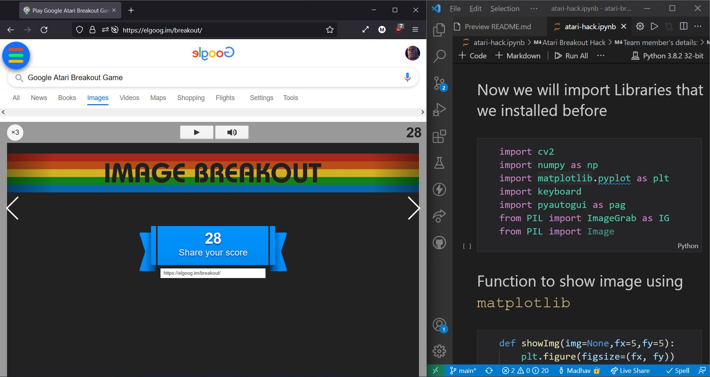
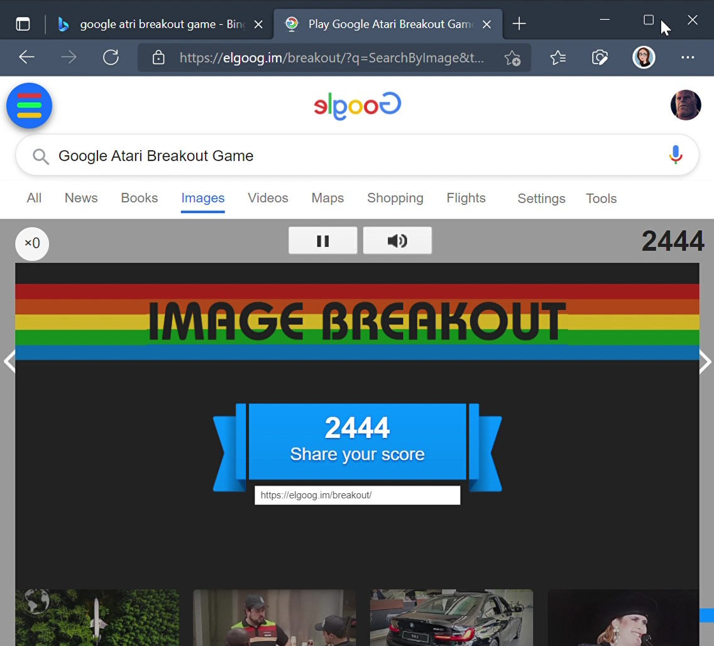

# **IIT Goa Hack the Game: Google-Atari-breakout-hack**

## Update:
We won the Hackathon [IIT Goa's Cepheus: HackTheGame](https://iitgoa.ac.in/cepheus/#/cepheus/workshops/hackTheGames) 🎉🥳

# ⭐Introduction 
*Automating game using openCV in python*

## **Original Game:**

 Atari Breakout is a hidden Google game which turns Google Images into a playable classic arcade video game with a Google twist. The aim of the game is to bat the ball at the colored blocks until there are none left, while making sure the ball does not pass your paddle.

Game link: https://elgoog.im/breakout

## **Automated Game using OpenCV:**

 The original Game operates through user by mouse or keyboard keys. But in the automated Version, the game requires no such operations from user. Game is played automatically by object detection and template matching.

## Team Details
Team Name: ***thisDot***
1. Madhav jha  (**F4ABBC53**)
2. Anjali kushwaha  (**EEBAE845**)

# ⭐Getting Started

## Requirements:
1. Python Installed in PC/laptop
2. Internet connection
3. Browser to play game in

## Process

1. Starting the game:https://elgoog.im/breakout/ 🔌
2. Resize the window as following:

3. Splitting the screen into two halfs(as shown in picture)🖥️

4. Running the code.

# ⭐Understanding the code

## **Libraries used in the code:**

1. ***openCV*** for object detection and template matching
The game contains a ball(object which has to be detected) which moves accordingly after hitting the slider in specific path. For automating the game
The ball image is read through the method cv2.imgread and detected through cv2.matchTemplate

2. ***numpy*** 
3. ***matplotlib.pyplot*** as plt
4. ***pyautogui*** for keyboard functionality
5. ***ImageGrab*** for capturing screen.

## ***Functions Used***
1. ***def showImg*** -for displaying Image
2. ***def readImg*** - for reading Image
3. ***def grab_screen_img*** - for capturing screen

# ⭐Working of the game hack
1. We take ScreenShot of the region where game is being played
2. We keep track of the ball current location via `newX and newY` variables and previous location via `preX and preY`
3. To trace the `ball` we draw a `circle` at it's center and a `rectangle` around it
4. Using values after many games we change the position of the `platform` with regards to the ball current position + acceleration in X and Y positions + etc.

## **NOTE:** To break from the while loop press `q`
 
 

# Here's Our HighScore, think you can beat it ?? 🤔

# ⭐Important Links
Github repo: https://github.com/jhamadhav/atari-breakout-hack  
Demo video: [link](./thisDot-atari-break-out-hack-demo.mp4)  
Youtube link for HighScore video: https://youtu.be/NGpsUYme_vk  
Drive link for HighScore video: https://drive.google.com/folderview?id=1abjxEn0O53cpht0BiNOV0o6mRnGguA5s  

## Thank you !!! 🎉🥳
